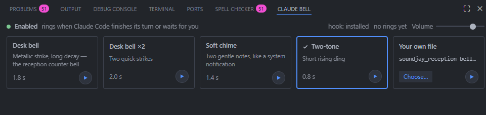

# Claude Bell

Chime in your VS Code window when Claude Code finishes its turn or waits for your permission. The sound is produced **on your machine**, so it works when Claude Code runs over SSH or in WSL.

Звук в вашем окне VS Code, когда Claude Code закончил ответ или ждёт разрешения. Звук рождается **на вашей машине**, поэтому работает при подключении по SSH и в WSL.

The **Claude Bell** tab lives in the bottom Panel next to Terminal: pick a sound card, preview it with ▶, choose your own file, set the volume. / Вкладка **Claude Bell** живёт в нижней панели рядом с Terminal: выберите карточку звука, послушайте по ▶, подключите свой файл, задайте громкость.

## Self-contained / Ничего больше не нужно

On first start the extension installs its own hook into Claude Code's user settings (`~/.claude/settings.json` on the machine where Claude Code runs): two plain shell one-liners on the **Stop** and **Notification** events that append a line to a signal file. No plugin, no Node, nothing else to install. New Claude Code conversations ring right away; in an already open one type `/hooks` once. Turn this off with `claudeBell.installHook: false`; uninstalling the extension removes the hook.

При первом запуске расширение само ставит свой хук в настройки Claude Code (`~/.claude/settings.json` на машине, где работает Claude Code): две shell-команды на события **Stop** и **Notification**, дописывающие строку в сигнальный файл. Ни плагина, ни Node, ничего ставить не нужно. Новые беседы Claude Code звенят сразу; в уже открытой один раз наберите `/hooks`. Отключить: `claudeBell.installHook: false`; удаление расширения убирает хук.

The optional `bell` Claude Code plugin from this repository does the same job for people who use Claude Code in a plain terminal without VS Code. Both installed together ring once.

Необязательный плагин `bell` для Claude Code из этого репозитория делает то же для тех, кто работает с Claude Code в обычном терминале без VS Code. Вместе они не дублируют звук.

## Install / Установка

Download `claude-bell-<version>.vsix` from the repository releases, then in VS Code: Extensions → `…` → **Install from VSIX**. For an SSH or WSL window VS Code installs it on the remote side automatically.

Скачайте `claude-bell-<version>.vsix` из релизов репозитория, затем в VS Code: Extensions → `…` → **Install from VSIX**. В окне SSH или WSL расширение само встанет на удалённую сторону.

## How it works / Как устроено

Claude Code runs the extension's hook when a turn ends (Stop) or when it waits for your permission or has been idle (Notification `permission_prompt` / `idle_prompt`). The hook appends a line to `~/.claude/.claude-bell-signal`. The extension watches that file and tells a small webview in the Panel to play the chime with Web Audio, or your own file. Webviews always render on your machine, which is why the sound reaches you over SSH. While the extension is alive it keeps `~/.claude/.claude-bell-extension` fresh, and the optional `bell` plugin then skips its own OS player, so nothing rings twice.

Commands: **Claude Bell: Install hook into Claude Code** and **Claude Bell: Remove hook from Claude Code** redo or undo the hook by hand.

## Commands and settings / Команды и настройки

- `Claude Bell: Play test chime` — hear it now. / Послушать сейчас.
- `Claude Bell: Enable / Disable` — also the bell in the status bar. / Также колокольчик в строке состояния.
- `claudeBell.volume` (0–1), `claudeBell.enabled`, `claudeBell.signalFile`.

Keep the **Claude Bell** view open in the Panel (any Panel tab may be active). If the panel says sound is locked, click **Enable sound** once.

## Silent? / Тихо?

1. Look at the bell in the status bar: a crossed bell means the extension is disabled — one click turns it back on. / Перечёркнутый колокольчик в строке состояния значит «выключено», один клик включает обратно.
2. View → Output → choose **Claude Bell** in the dropdown: every signal, ring and skip is logged there. / В Output выберите канал **Claude Bell**: там каждая строка сигнала и каждый звонок.
3. `~/.claude/.claude-bell-last` on the Claude Code machine shows the hook's last ring; `"code":"extension"` means the hook handed the sound to this extension. / Файл на машине Claude Code показывает последний вызов хука.

Держите вид **Claude Bell** открытым в нижней панели (активной может быть любая вкладка). Если панель пишет, что звук заблокирован, один раз нажмите **Enable sound**.
